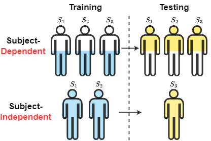

# How To Evaluate Your Medical Time Series Classification?


## Overview  
This repository contains the of the paper *How To Evaluate Your Medical Time Series Classification?*. 
In this paper, discuss the unique challenge introduced by medical time series(MedTS) due to the existence of subject-specific features.
Here, we categorize the existing evaluation setups into two primary categories: subject-dependent and subject-independent. 
We show the subject-independent setup is more appropriate for different datasets and tasks. 
Our theoretical analysis explores the feature components of MedTS, examining how different evaluation setups influence the features that a model learns.


## Types of MedTS Datasets
 

S and C denote subject and class, respectively. 
1) Single-Subject and Multi-Class (Type-I). This type of MedTS is typically used to develop
models tailored to a specific subject. Examples include designing brain-computer interfaces for
individuals with disabilities or building personalized health
monitoring systems using wearable devices. 
2) Multi-Subject and Multi-Class (Type-II). The second type is used to design general models
that can adapt to multiple subjects with varying classes. For instance, mental state recognition
systems or sleep state classification systems fall under this category.
3) Multi-Subject and Single-Class (Type-III). In the third type, each subject is assigned a single
class that remains consistent over time. For example, once a subject is diagnosed with Alzheimer’s
Disease during the data collection stage, this subject is always classified as an AD patient. This type
of MedTS is often used as a low-cost diagnostic method to supplement or replace more traditional medical approaches.

## MedTS Evaluation Setups
<p float="left">
  
  
</p>

(a) This diagram shows the two main evaluation setups and their sub-types, 
(b) This figure adopted from [Medformer](https://arxiv.org/pdf/2405.19363) shows the differences between the two main setups: subject-dependent and subject-independent.

1) Subject-Dependent: Samples from different subjects are randomly shuffled and split into training,
validation, and test sets, allowing the same subject’s data to appear in all three sets. Depending
on whether a causal split is applied, the subject-dependent setup can be further divided into two
subtypes: **Mixed (random split)**: The splitting of samples from each subject does not account for
causal relationships; instead, samples are randomly mixed. This means that stratification occurs without regard for temporal order. **Causal
(temporal split)**: The split considers the temporal relationship in the time series for each subject,
the past samples included in the training set, and future samples placed in the validation and test
sets. This causal setup is necessary for time series forecasting tasks but is rarely adopted in existing time series classification tasks. 

2) Subject-Independent: The training, validation, and test sets are split by subjects, ensuring that
samples from the same subject ID are exclusively included only in one of the three sets. Subject-
independent setup can be further divided into two subtypes: **Leave-One-Out**: Leave only one
subject for testing, while all other subjects are used for training. Due to the limited sample size of a single subject, cross-validation is
generally necessary to avoid biased evaluations. However, this setup does not include a dedicated
validation set, which can lead to overfitting. **Leave-N-Out**: Leave N subjects for validation and/or
test sets. In this setup, a larger pool of subjects is used for testing, making it more robust than the leave-one-out approach.


## Datasets
### Data preprocessing

For [TDBrain](https://brainclinics.com/resources/), [ADFTD](https://openneuro.org/datasets/ds004504/versions/1.0.6), [PTB](https://physionet.org/content/ptbdb/1.0.0/), [PTB-XL](https://physionet.org/content/ptb-xl/1.0.3/) four datasets, we follow the same preprocessing steps as [Medformer](https://arxiv.org/pdf/2405.19363). Code is available in their [repo](https://github.com/DL4mHealth/Medformer).
Since TDBrain need permission to get access first, we do not provide a download link for processed data here. 
Users need to request permission to download the raw data on the TDBrain official website and preprocess it with the jupyter notebook they provided.
The processed data should be put into `dataset/DATA_NAME/` so that each subject file can be located by `dataset/DATA_NAME/Feature/feature_ID.npy`, and the label file can be located by `dataset/DATA_NAME/Label/label.npy`.  

The processed datasets can be manually downloaded at the following links.
* ADFTD dataset: https://drive.google.com/file/d/1QcX_M58IQUBn3lDBlVVL0SDN7_QI1vWe/view?usp=drive_link
* PTB dataset: https://drive.google.com/file/d/14fBIXc2gSHm00wLaejNIsPgitc-wZdXu/view?usp=drive_link
* PTB-XL dataset: https://drive.google.com/file/d/1whskRvTZUNb1Qph2SeXEdpcU2rQY0T1E/view?usp=drive_link


## Experimental setups
We evaluate our model in two settings: subject-dependent and subject-independent.
In the subject-dependent setup, samples from the same subject can appear in both the training and test sets, causing information leakage. 
In a subject-independent setup, samples from the same subject are exclusively in either the training or test set, which is
more challenging and practically meaningful but less studied.

We use four methods, including 
MLP, 
[TCN](https://github.com/locuslab/TCN),
[Transformer](https://github.com/jadore801120/attention-is-all-you-need-pytorch),
and [Medformer](https://github.com/DL4mHealth/Medformer),
to improve the robustness of the results and demonstrate the assumptions of our theoretical analysis. We implement all the methods based on the [Time-Series-Library](https://github.com/thuml/Time-Series-Library) project from Tsinghua University, 
which integrates all methods under the same framework and training techniques to ensure a relatively fair comparison.


## Requirements  
  
The recommended requirements are specified as follows:  
* Python 3.8  
* Jupyter Notebook  
* einops==0.4.0
* matplotlib==3.7.0
* numpy==1.23.5
* pandas==1.5.3
* patool==1.12
* reformer-pytorch==1.4.4
* scikit-learn==1.2.2
* scipy==1.10.1
* sktime==0.16.1
* sympy==1.11.1
* torch==2.0.0
* tqdm==4.64.1
* wfdb==4.1.2
* neurokit2==0.2.9
* mne==1.6.1 
* natsort~=8.4.0
  
The dependencies can be installed by:  
```bash  
pip install -r requirements.txt
```


## Run Experiments
Before running, make sure you have all the processed datasets put under `dataset/`. For Linux users, run each method's shell script in `scripts/classification/`. 
You could also run all the experiments by running the `meta-run.py/` file, which the method included in _skip_list_ will not be run.
For Windows users, see jupyter notebook `experimenets.ipynb`. All the experimental scripts are provided cell by cell. 
The gpu device ids can be specified by setting command line `--devices` (e,g, `--devices 0,1,2,3`). 
You also need to change the visible gpu devices in script file by setting `export CUDA_VISIBLE_DEVICES` (e,g, `export CUDA_VISIBLE_DEVICES=0,1,2,3`). 
The gpu devices specified by commend line should be a subset of visible gpu devices.
Taking method Medformer as example, here are the sample scripts to run the experiments for the four datasets.


Scripts for Subject-Dependent(Sub-Dep), Subject-Independent(Sub-Indep), Subject-Discrimination(Sub-Disc),
Random-Label Subject-Dependent(R-Sub-Dep), and Random-Label Subject-Independent(R-Sub-Indep), respectively.
```bash
.\scripts\Sub-Dep\Medformer.sh
.\scripts\Sub-Indep\Medformer.sh
.\scripts\Sub-Disc\Medformer.sh
.\scripts\R-Sub-Dep\Medformer.sh
.\scripts\R-Sub-Indep\Medformer.sh
```


After training and evaluation, the saved model can be found in`checkpoints/classification/`; 
and the results can be found in  `results/classification/`. 
You can modify the parameters by changing the command line. 
The meaning and explanation of each parameter in command line can be found in `run.py` file.

## Partial Results
Results of **ADFTD** dataset (3-classes classification) run with Medformer under different setups.

|             | Accuracy | F1 Score |
|:------------|:--------:|---------:|
| Sub-Disc    |  98.78%  |   98.72% |
| Sub-Dep     |  97.66%  |   97.56% |
| R-Sub-Dep   |  97.14%  |   97.12% |
| Sub-Indep   |  52.37%  |   48.72% |
| R-Sub-Indep |  30.67%  |   29.82% |

It is interesting that R-Sub-Dep achieves almost the same performance as Sub-Dep.
R-Sub-Dep setup implies that there is no disease-related label information in the whole dataset.
How could it be possible that the R-Sub-Dep setup has a similar performance to the Sub-Dep setup?
In contrast, Sub-Indep to R-Sub-Indep have a significant performance drop.
F1 score under R-Sub-Indep setup is close to the random guess level 33%, 
which is reasonable since there is no disease-related features now.
_This result indicates that it is possible for the model to achieve deceptively high performance under the subject-dependent setup, 
while learning nothing about the disease-related features and using subject-specific features as a shortcut for disease label classification._


## Acknowledgement

This codebase is constructed based on the repo: [Time-Series-Library](https://github.com/thuml/Time-Series-Library).
Thanks a lot for their amazing work on implementing state-of-arts time series methods!
